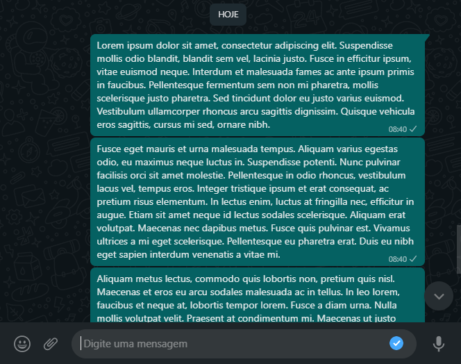

<p align="center">
  
  # An autonomous and very simple way to send a large amount of messages or type in some software with python.
  
</p>

## Required: 

```
pip install pyautogui 

```

# How Does this code?
<p>
  
- Place a text in the text file and each line of the file will be typed in the text field selected by you.
- After that enter will be pressed automatically very quickly.

</p>

<hr>
  
- If you send a lorem ipsum with whatsapp the result should be this:

<p align="center">
 
</p>

<hr>
